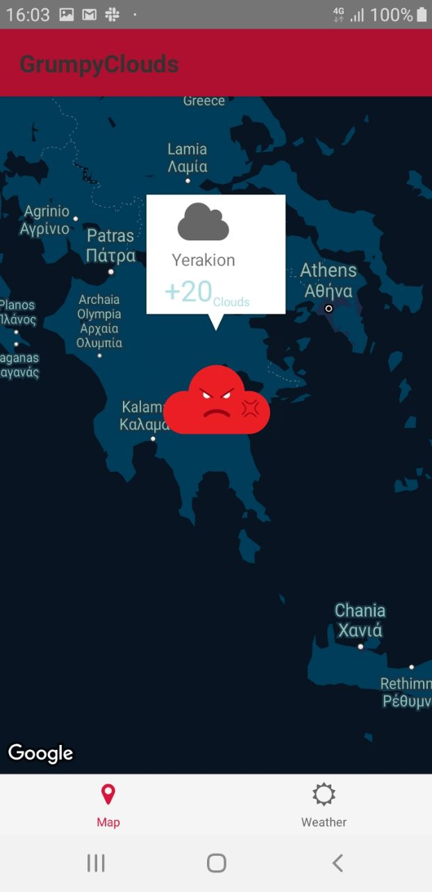
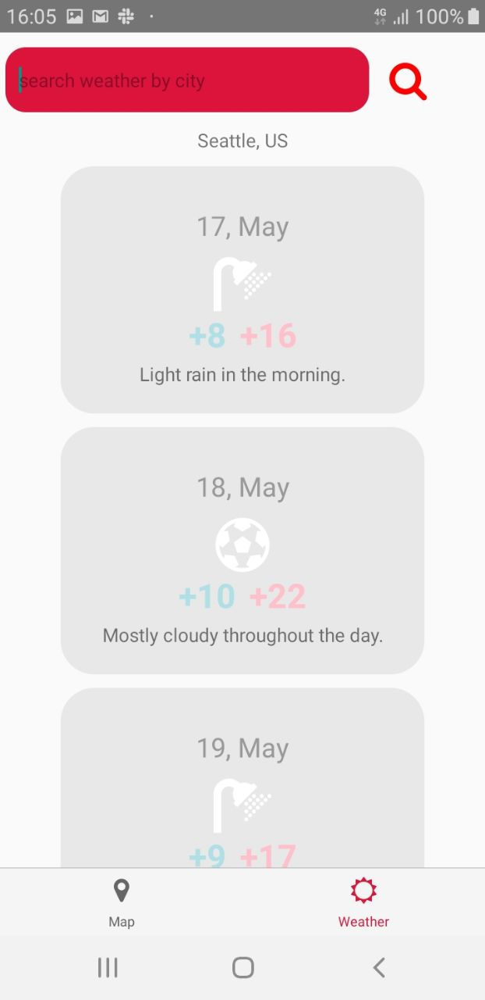

# Grumpy Clouds ☁️ ☁️ ☁️
## React Native Minimalistic Weather Forecast
List of API's used:
- Google Geocoding
- Open Weather Maps
- Dark Sky

<br>

### Usage:
About setting up an environment: <br> https://facebook.github.io/react-native/docs/getting-started.html
```
npm install
react-native run[android/ios]
```
<br>



